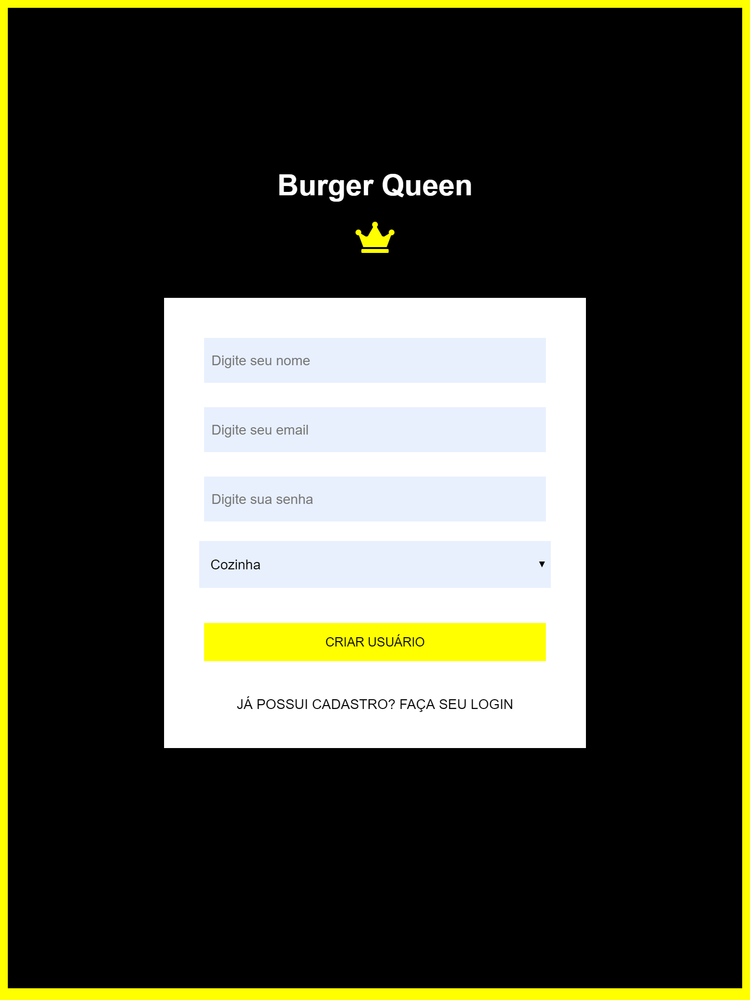
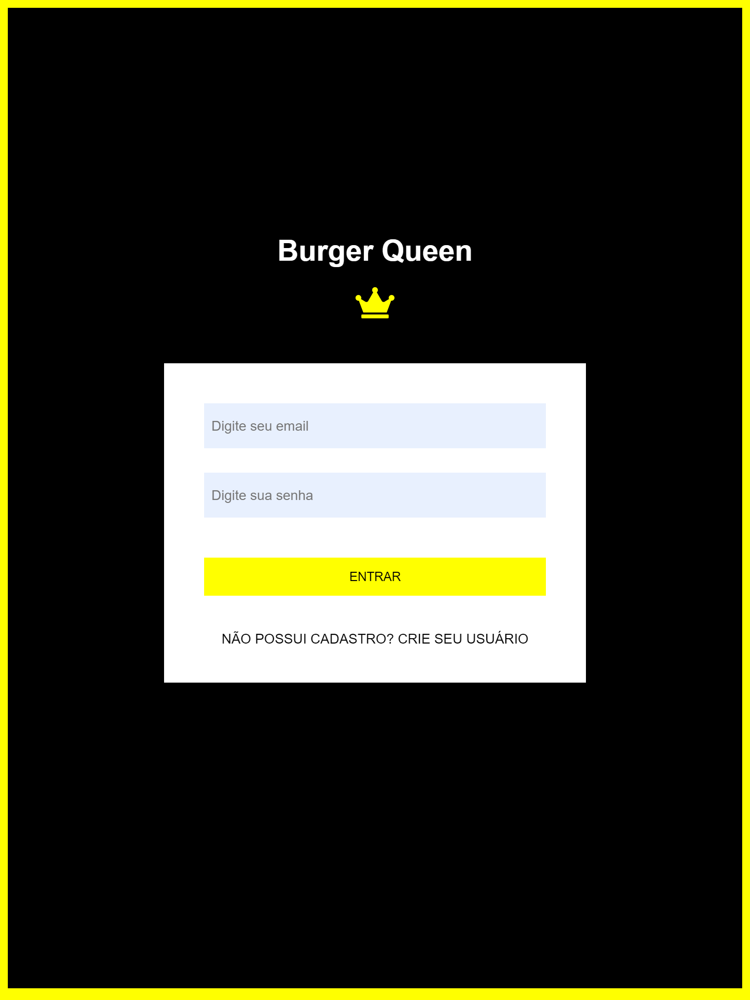
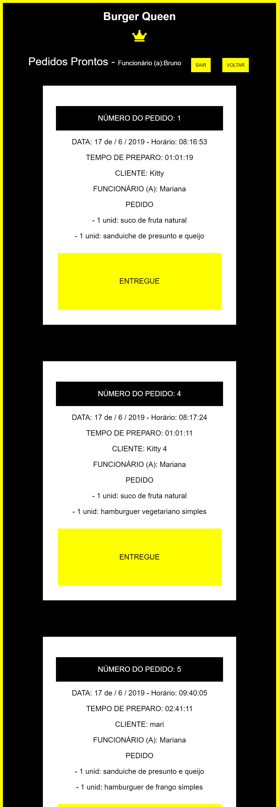

# Burger Queen

## Índice

* [1. Preâmbulo](#1-preâmbulo)
* [2. Resumo do projeto](#2-resumo-do-projeto)
* [3. Objetivos de aprendizagem](#3-objetivos-de-aprendizagem)
* [4. Considerações gerais](#4-considerações-gerais)
* [5. Critérios de aceitação mínima do
  projeto](#5-critérios-de-aceitação-mínima-do-projeto)
* [6. Dicas e leituras complementares](#7-dicas-e-leituras-complementares)

***

## 1. Preâmbulo

[React](https://reactjs.org/), [Angular](https://angular.io/) e
[Vue](https://vuejs.org/) são alguns dos _frameworks_ e _bibliotecas_ de
JavaScript mais usados na área de desenvolvimento ao redor do mundo e existe uma
razão para isso. No contexto do navegador, [_manter a interface sincronizada com
o estado é difícil_](https://medium.com/dailyjs/the-deepest-reason-why-modern-javascript-frameworks-exist-933b86ebc445).

Ao eleger um _framework_ ou _biblioteca_ para nossa interface, nos apoiamos em
uma série de convenções e implementações _testadas_ e _documentadas_ para
resolver um problema comum a toda interface web. Isto nos permite concentrar
melhor (dedicar mais tempo) nas características _específicas_ de nossa
aplicação.

Quando escolhemos uma destas tecnologias não só importamos um pedaço de código
para reusar (o qual já é um grande valor por si só), mas também adotamos uma
**arquitetura**, uma série de **princípios de design**, um paradigma, algumas
**abstrações**, um **vocabulário**, uma **comunidade**, etc...

Como desenvolvedora Front-end, estes kits de desenvolvimento podem resultar em
uma grande ajuda para implementar rapidamente _features_ dos projetos em que
você for trabalhar.

## 2. Resumo do projeto

Desta vez temos um projeto 100% por demanda. Você sempre pode (e deve) fazer
sugestões de melhora e mudança, mas muitas vezes trabalhará em um projeto em que
primeiro deve se assegurar de cumprir os requisitos.

Um pequeno restaurante de hambúrgueres, que está crescendo, necessita uma
interface em que se possa realizar pedidos utilizando um _tablet_, e enviá-los
para a cozinha para que sejam preparados de forma ordenada e eficiente (através
de um _backend_ que os detalhes serão dados mais adiante).


Estas são as informações que temos do cliente:

> Somos **Burger Queen**, um fast food 24hrs.
>
>A nossa proposta de serviço 24 horas foi muito bem recebida e, para continuar a
>crescer, precisamos de um sistema que nos ajude a receber pedidos de nossos
>clientes.
>
>Nós temos 2 menus. Um muito simples para o café da manhã:
>
>| Ítem                      |Preço R$|
>|---------------------------|------|
>| Café americano            |    5 |
>| Café com leite            |    7 |
>| Sanduíche de presunto e queijo|   10 |
>| Suco de fruta natural     |    7 |
>
>E outro menu para o resto do dia:
>
>| Ítem                      |Preço |
>|---------------------------|------|
>|**Hambúrgueres**           |   **R$**   |
>|Hambúrguer simples         |    10|
>|Hambúrguer duplo           |    15|
>|**Acompanhamentos**        |   **R$**   |
>|Batata frita               |     5|
>|Anéis de cebola            |     5|
>|**Bebidas**                |   **R$**   |
>|Água 500ml                 |     5|
>|Água 750ml                 |     7|
>|Bebida gaseificada 500ml   |     7|
>|Bebida gaseificada 750ml   |    10|
>
>**Importante:** Os clientes podem escolher entre hambúrgueres de carne bovina,
>frango ou vegetariano. Além disso, por um adicional de R$ 1,00 , eles podem
>adicionar queijo ou ovo.
>
>Nossos clientes são bastante indecisos, por isso é muito comum que eles mudem o
>seu pedido várias vezes antes de finalizar.

A interface deve mostrar os dois menus (café da manhã e restante do dia), cada
um com todos os seus _produtos_. O usuário deve poder escolher que _produtos_
adicionar e a interface deve mostrar o _resumo do pedido_ com o custo total.


## 3. Objetivos de aprendizagem

O objetivo principal é aprender a construir uma interface web usando React. Esse framework front-end ataca o seguinte problema: **como manter a interface e estado sincronizados**. Portanto, esta experiência espera familiarizá-la com o conceito de estado da tela, e como cada mudança no estado vai refletir na interface (por exemplo, toda vez que adicionamos um _produto_ para um _pedido_, a interface deve atualizar a lista de pedidos e o total). A interface deve ser projetada especificamente para rodar em **tablets**.

Como objetivo **SECUNDÁRIO**, você deve seguir as recomendações para PWAs (_Progressive Web Apps_), que inclui conceitos como **offline**. Para orientá-las sobre este tema,recomendamos que você use [Lighthouse](https://developers.google.com/web/tools/lighthouse/?hl=es), que é uma ferramenta do Google que nos ajuda a garantir que nossos aplicativos web sigam "boas práticas".

Tópicos: _react_, _pwa_, _offline-first_, _service-worker_.
 
## 4. Considerações gerais

Este projeto é individual.

Trabalhe integralmente uma história de usuário antes de passar para a próxima. Cumpra todas as histórias possíveis dentro do tempo especificado.

A lógica do projeto deve ser totalmente implementada em JavaScript (ES6 +), HTML e CSS e empacotada de forma automatizada. Neste projeto você deve usar [React](https://reactjs.org/).

O aplicativo deve ser um _Single Page App_. Os pedidos serão enviados por meio de um _tablet_, mas **não queremos um aplicativo nativo**, mas sim um aplicativo Web que seja **responsivo** e possa funcionar **offline**.

Precisamos pensar bem sobre o UX para aqueles que vão receber os pedidos, o tamanho e a aparência dos botões, a visibilidade do estado atual do pedido, etc.

O aplicativo deve usar scripts `npm-scripts` e ter` start`, ` build` e `deploy`, que são responsáveis por iniciar, empacotar e implantar o aplicativo, respectivamente.

Este projeto inclui um _boilerplate_ com o código necessário para começar. A parte de back-end já foi resolvida. O _boilerplate_ inclui os seguintes arquivos/pastas com configurações do Firebase(hosting, firestore e functions):

```text
./04-burger-queen/
├── firebase.json
├── firestore.indexes.json
├── firestore.rules
├── functions
│   ├── index.js
│   ├── package.json
└── README.md
```

A parte da interface não está incluída, então, você deve definir a estrutura das
pastas e arquivos que considera necessários. Você pode estruturá-los de acordo
com as convenções do React. Portanto, os _setups_ necessários para
executá-los serão feitos por você.

Para iniciar este projeto você terá que fazer um _fork_ e _clone_ deste repositório.

## 5. Critérios mínimos de aceitação do projeto

### Definição do produto

O [_Product Owner_](https://www.youtube.com/watch?v=7lhnYbmovb4) nos apresentou
este _backlog_ que é o resultado do seu trabalho com o cliente até hoje
***

#### [História de usuário 1] Usuário deve ter seu perfil (login/senha) para acessar o sistema.

Eu como funcionário do restaurante quero entrar na plataforma e ver apenas a
tela imporante para o meu trabalho.

##### Critérios de aceitação

O que deve acontecer para satisfazer as necessidades do usuário?

* Criar login e senha.
* Criar tipo de usuário (cozinha / salão).
* Entrar na tela correta para cada usuário.

##### Definição de pronto

O acordado abaixo deve acontecer para dizer que a história está terminada:

* Você deve ter recebido _code review_ de pelo menos uma parceira.
* Você fez _testes_ de usabilidade e incorporou o _feedback_ do usuário.
* Você deu deploy de seu aplicativo e marcou sua versão (tag git).

***

#### [História de usuário 2] Garçom/Garçonete deve ser capaz de anotar o pedido do cliente

Eu como garçom/garçonete quero poder anotar o pedido de um cliente para não
depender da minha memória, saber quanto cobrar e poder enviar os pedidos para a
cozinha para serem preparados em ordem.

##### Critérios de aceitação

O que deve acontecer para satisfazer as necessidades do usuário?

* Anotar o nome do cliente.
* Adicionar o nome do garçom/garçonete ao pedido
* Adicionar produtos aos pedidos.
* Excluir produtos.
* Ver resumo e o total da compra.
* Enviar o pedido para a cozinha (guardar em algum banco de dados).
* Funcionar bem e se adequar a um _tablet_.

##### Definição de pronto

O acordado abaixo deve acontecer para dizer que a história está terminada:

* Você deve ter recebido _code review_ de pelo menos uma parceira.
* Você fez _testes_ de usabilidade e incorporou o _feedback_ do usuário.
* Você deu deploy de seu aplicativo e marcou sua versão (tag git).

***

#### [História de usuário 3] Chefe de cozinha deve ver os pedidos

Eu como chefe de cozinha quero ver os pedidos dos clientes em ordem, poder marcar que estão prontos e poder notificar os garçons/garçonetes que o pedido está pronto para ser entregue ao cliente.

##### Critérios de aceitação

* Ver os pedidos à medida em que são feitos.
* Marcar os pedidos que foram preparados e estão prontos para serem servidos.
* Ver o tempo que levou para preparar o pedido desde que chegou, até ser marcado como concluído.

##### Definição de pronto

* Você deve ter recebido _code review_ de pelo menos uma parceira.
* Você fez _testes_ de usabilidade e incorporou o _feedback_ do usuário.
* Você deu deploy de seu aplicativo e marcou sua versão (tag git).

***

#### [História de usuário 4] Garçom/Garçonete deve ver os pedidos prontos para servir

Eu como garçom/garçonete quero ver os pedidos que estão prontos para entregá-los rapidamente aos clientes.

##### Critérios de aceitação

* Ver a lista de pedidos prontos para servir.
* Marque os pedidos que foram entregues.

##### Definição de pronto

* Você deve ter recebido _code review_ de pelo menos uma parceira.
* Você fez _testes_ de usabilidade e incorporou o _feedback_ do usuário.
* Você deu deploy de seu aplicativo e marcou sua versão (tag git).
* Os dados devem ser mantidos intactos, mesmo depois que um pedido terminado. Tudo isso para poder ter estatísticas no futuro.

***

## Interface do produto






## Road Map
### v1.0.0
#### Breaking changes
#### History 1

- Arquivo criado no Firebase
- Configuração do firebase adicionada ao projeto
-  Criar tipo de usuário (cozinha / salão), cadastrando com nome, email e senha e salvando automaticamente no database
- Autenticação com email e senha pelo firebase
- Components Input e Button criados na pasta components
- Pasta pages criada com arquivo Javascript Home(tela de login), Salão e Cozinha
- Redireciona para tela correta para cada tipo de usuário
- Route direcionando para a página de cada tipo de usuário (salão/cozinha)
- Link redirecionando para tela inicial (Home)
- Import de ícone de logo de [fontawesome](https://fontawesome.com)

### v2.0.0
#### Breaking changes
#### History 2

- Redireciona para tela correta para cada tipo de usuário 
- Arquivo JSON criado para o cardápio e trazido com import na página Salao 
- Página Salao exibindo botões com menu
- Components Input e Button import 
- Traz o nome do usuário logado através do displayName salvo no database
- Os botões selecionados exibem na tela o item escolhido com valor e quantidade exibindo no final a soma do valor total, aparecendo junto um botão de delete para cada item caso o cliente queira excluir
- Input para colocar o nome do usuário e Button para criar o pedido depois de confirmada a escolha da compra
- Função reset para zerar a tela depois que o botão Criar pedido foi clicado
- Envia informações do pedido para uma pasta Order criada no database, informando o nome do cliente, o pedido escolhido(com nome, preço e quantidade), a hora em que o pedido foi feito, o empregado que realizou o pedido, e o status do pedido(kitchen) 
- Link redirecionando para tela inicial (Home)

### v3.0.0
#### Breaking changes
#### History 3

- Página Kitchen exibindo pedidos realizados na ordem em que foram tirados salvos no database
- Components Input e Button import
- Traz o nome do usuário logado através do displayName salvo no database
- Exibe o número do pedido, data e horário em que foi feito o pedido, nome do cliente, nome do funcionário que retirou o pedido e  a lista com os itens do pedido
- Button para concluir o pedido e enviar para a lista de pedidos prontos mudando o status no database na pasta Order para hall, gravando a hora que foi concluído, o cálculo do tempo de preparo (cálculo funciona com diferença de um dia para outro - pedido feito antes da meia noite e pronto no dia seguinte calcula as horas corretas), e o número do pedido
- Criação da página List que traz a lista de pedidos prontos na ordem que foram concluídos 
- Link que redireciona para a página List que exibe a lista de pedidos prontos (tanto na página Kitchen como na Hall - antiga Salao)
- Button redirecionando para tela inicial (Home), fazendo logout (tanto na página Kitchen quanto Hall)
- Criação da tela Create separando a criação do usuário da página Home que faz apenas o login
- CSS responsivo para tela de notebook e tablet

### v4.0.0
#### Breaking changes
#### History 4

- Página List exibindo pedidos concluídos da cozinha na ordem em que foram preparados
- Button import
- Traz o nome do usuário logado através do displayName salvo no database
- Exibe o número do pedido, data e horário em que foi feito o pedido, nome do cliente, tempo de preparo do pedido, nome do funcionário que retirou o pedido e  a lista com os itens do pedido
- Button para marcar como entregue o pedido e enviar para a lista de pedidos concluídos mudando o status no database na pasta Order para ok
- Link que redireciona para a página que o usuário utiliza (Kitchen ou Hall) 
- Button redirecionando para tela inicial (Home), fazendo logout
- CSS responsivo para tela de notebook e tablet

## 6. Dicas e leituras complementares

### Primeros passos

1. O primeiro passo deste projeto deve ser converter o menu descrito pelo cliente em uma estrutura JSON para mais tarde _printar_ na tela.

2. Faça um _fork_ deste repositório (no GitHub).

3. Clone seu _fork_ no seu computador:

   ```sh
   git clone git@github.com:<tu-usuario-de-github>/<cohortid>-burger-queen.git
   cd <cohortid>-burger-queen
   ```

4. Crie uma branch da `master` para começar a trabalhar. Por exemplo:

   ```sh
   git checkout -b develop
   ```

5. Crie um projeto no [Firebase](https://firebase.google.com/)

6. Habilite o Firestore (_começar em modo bloqueado_) nas "Bases de Dados" de [Firebase console](https://console.firebase.google.com/).

7. Instale o utilitário de linha de comando do Firebase:

   ```sh
   npm i -g firebase-tools
   ```

8. Adicione o ambiente de produção para fazer o deploy:

   ```sh
   firebase use --add
   ```

9. Instale dependências de cloud functions:

   ```sh
   # usando yarn
   cd functions && yarn && cd ..
   # alternativamente, usando npm
   cd functions && npm install && cd ..
   ```

10. Rode o comando: `firebase deploy`

11. Neste ponto, você pode começar com o _front-end_ :wink:

***

Nota para a utilização do `create-react-app`:

Se você tentar usar o `create-react-app` no diretório do projeto, você receberá
um erro dizendo que há arquivos que podem apresentar um conflito. Para evitar
esse problema você pode criar um novo aplicativo usando `create-react-app` e a
partir daí _ junte com a pasta do projeto:

```sh
# se estava na pasta do projeto, fomos para a pasta acima
cd ..

create-react-app burger-queen-tmp
cp -r burger-queen/* burger-queen-tmp/
cp -r burger-queen-tmp/.gitignore burger-queen-tmp/* burger-queen/
rm -rf burger-queen-tmp
cd burger-queen
```

### Outros recursos

#### Frameworks / bibliotecas

* [React](https://reactjs.org/)

#### Ferramentas

* [npm-scripts](https://docs.npmjs.com/misc/scripts)
* [Babel](https://babeljs.io/)
* [webpack](https://webpack.js.org/)

#### PWA

* [Seu primeiro Progressive Web App - Google
  developers](https://developers.google.com/web/fundamentals/codelabs/your-first-pwapp/?hl=es)
* [Progressive Web Apps -
  codigofacilito.com](https://codigofacilito.com/articulos/progressive-apps)
* [offlinefirst.org](http://offlinefirst.org/)
* [Usando Service Workers -
  MDN](https://developer.mozilla.org/pt-BR/docs/Web/API/Service_Worker_API/Using_Service_Workers)
* [Como habilitar dados sem conexão - Firebase
  Docs](https://firebase.google.com/docs/firestore/manage-data/enable-offline?hl=es-419)

#### Serverless

* [Serverless Framework 1.0 - Pagar.me Talks](https://www.youtube.com/watch?v=2oNovfw3V08)
* [Firebase](https://firebase.google.com/)
* [Serverless Architectures - Martin
  Fowler](https://www.martinfowler.com/articles/serverless.html)

#### Cloud functions

* [Cloud functions - Firebase
  Docs](https://firebase.google.com/docs/functions/?hl=es-419)

## Checklist

### Geral

* [x] O produto final segue as diretrizes.

### `README.md`

* [x] Processo de design de documentos.
* [x] Inclui informações para desenvolvedores (deps, instalação, uso, implantação, teste,
   ...)

#### HU

#### HU 1: Perfil de usuário

* [x] Criar login e senha.
* [x] Criar tipo de usuário (cozinha / salão).
* [x] Entrar na tela correta para cada usuário.

#### HU 2: Anotar pedidos

* [x] Digite o nome do cliente.
* [x] Filtre _menu_ para _café da manhã_ e _almoço/jantar_.
* [x] Adicionar item ao pedido.
* [x] Excluir item do pedido.
* [x] Mostra _resumo_ do pedido com todos os itens e o total.
* [x] Enviar para a cozinha (isso deve salvar o pedido).

#### HU 3: Ver pedidos na cozinha

* [x] Visualização de pedidos pendentes para produção.
* [x] Marcar pedido como como pronto para entrega.
* [x] Ver histórico dos pedidos.

#### HU 4: Entrega de pedidos

* [x] Visualização de pedidos pendentes para entrega.
* [x] Marcar pedido como entregue ao cliente.

### UX

* [x] É bem e funciona bem em tablets.
* [x] Você pode _adicionar a tela inicial_ como um aplicativo da web (ele tem um manifesto,
  ícones, ...) em iOS e Android.
* [x] Fácil utilização em telas sensíveis ao toque (telas sensíveis ao toque).
* [x] Status atual do pedido sempre visível enquanto fazemos um pedido.

### Testes (Se quiserem fazer)

* [ ] 70% ou mais em cobertura de _statements_.
* [ ] 70% ou mais em cobertura de _functions_.
* [ ] 70% ou mais em cobertura de _lines_.
* [ ] 70% ou mais em cobertura de _branches_.
